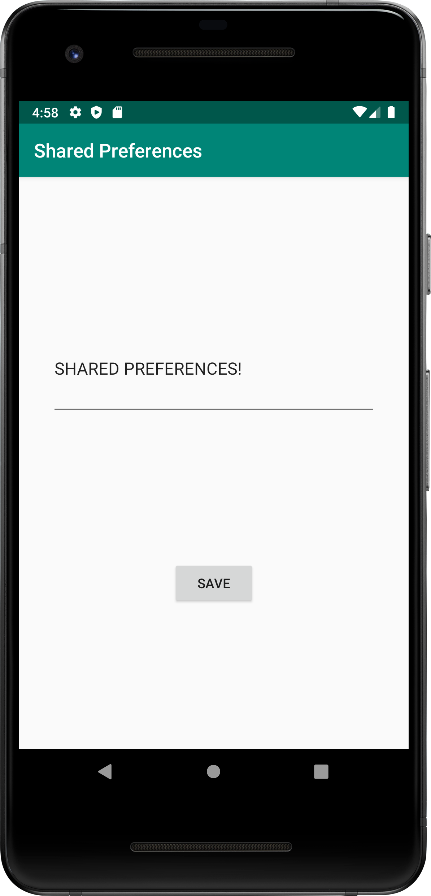
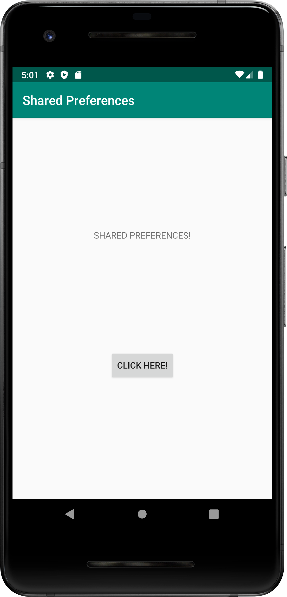

# Rapport

Först skapades en knapp i `MainActivity`. Sedan skapades en `SecondActivity`. Sedan tillbaka i MainActivity
skapades en klickbar knapp med funktionen `onClickner()`, så när man trycker på knappen i `MainActivity` 
kommer man till `SecondActivity`.

Därefter skapades en textEditor `EditText` i `SecondActivity` och en knapp `Button` i `SecondActivity`
med funktionen `onClickner()` så att man kommer tillbaka till `MainActivity`. 

## In MainActivity: Read data from Shared Preferences

Deklarede två nya variabler i `MainActivity` för att skapa `SharedPreferenses`.

Kod:

```
private SharedPreferences myPreferenceRef;
private SharedPreferences.Editor myPreferenceEditor;

```

Kod som lades till i `ActivityMain`, `onCreate`: 

```
   myPreferenceRef = getPreferences(MODE_PRIVATE);
   myPreferenceEditor = myPreferenceRef.edit();
```

od som lades till i `ActivityMain`, `onCreate` för att läsa en preference:

```
   TextView prefTextRef= findViewById(R.id.textView);
   prefTextRef.setText(myPreferenceRef.getString("key", "No preference found."));
   Skapade ny funktinen onResume

```

Kod som lades till i `MainActivity` för att läsa, visas i en preference från `SecondActivity` utan att 
gå tillbaka till `onCreate`. 
```
    @Override
    protected void onResume() {
        super.onResume();
        TextView sharedPrefData = findViewById(R.id.textView);
        sharedPrefData.setText(myPreferenceRef.getString("key", "Name"));
    }
```

Lade till `<string name="save">Save</string>` i `String.xml`.

## In SecondActivity: Write data to Shared Preferences using EditText

Deklarede två nya variabler i `SecondActivity` för att skapa `SharedPreferenses`.

Kod:

```
  private SharedPreferences myPreferenceRef;
  private SharedPreferences.Editor myPreferenceEditor;

```
Skapade referens till `preference object` genom att lägga till koden:

```
  myPreferenceRef = getPreferences(MODE_PRIVATE);
  myPreferenceEditor = myPreferenceRef.edit();

```

Sedan för att läsa in `preferences` från `EditText` lades kod till: 

```
  EditText prefTextRef = findViewById(R.id.editText);
  prefTextRef.setText(myPreferenceRef.getString("key", "Name:"));
```






